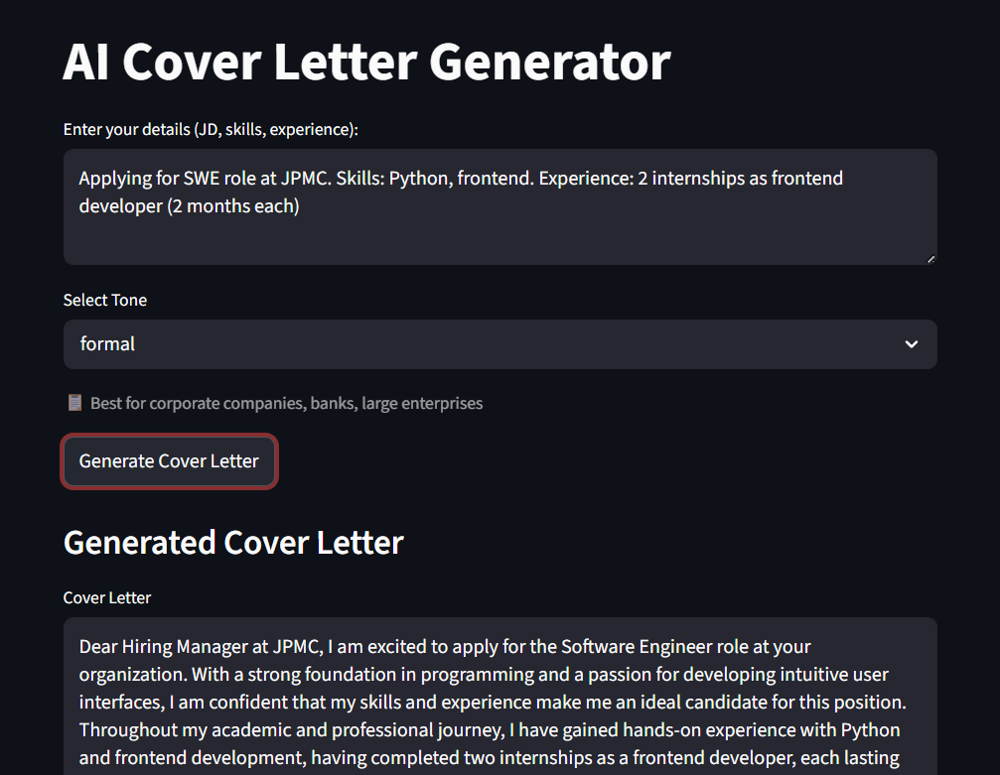
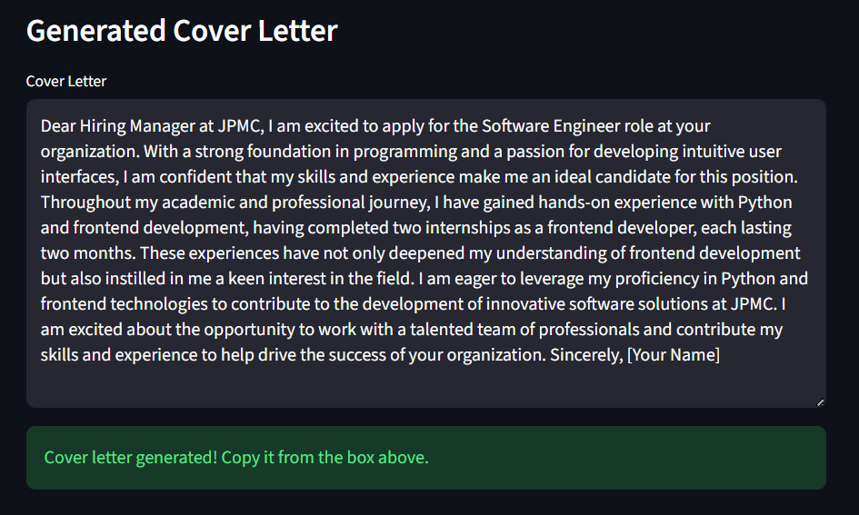

# AI Cover Letter Generator

An AI-powered cover letter generation application built using LangChain, Groq LLMs, Pydantic, and Streamlit.

The application generates personalized and professional cover letters based on user details like job description, skills, experience, and preferred tone.

---

## 🌐 Live Demo

👉 [Try it live here](https://ai-cover-letter-generator.streamlit.app)

---

## 🚀 Demo




---

## Features

- AI-generated personalized cover letters
- Detects fresher vs experienced candidate automatically
- Tone selection — Formal, Friendly, Confident
- Tone guide to help users pick the right tone
- Handles minimal or detailed input gracefully
- Structured output using Pydantic
- Built-in copy button for easy copying
- Clean and interactive Streamlit UI

---

## Tech Stack

- Python
- Streamlit
- LangChain
- Groq API (Llama 3.3 70B)
- Pydantic
- dotenv

---

## Project Structure

```text
ai-cover-letter-generator/
│
├── screenshots/
│   ├── demo1.png
│   └── demo2.png
├── app.py
├── model.py
├── requirements.txt
├── .env
└── README.md
```

---

## Installation

### Clone the Repository

```bash
git clone https://github.com/bangarukondabollapally/ai-cover-letter-generator.git
cd ai-cover-letter-generator
```

### Create Virtual Environment

```bash
python -m venv venv
```

Activate environment:

#### Windows
```bash
venv\Scripts\activate
```

#### Mac/Linux
```bash
source venv/bin/activate
```

### Install Dependencies

```bash
pip install -r requirements.txt
```

---

## Environment Variables

Create a `.env` file in the root directory:

```env
GROQ_API_KEY=your_api_key_here
```

Get your free API key at [groq.com](https://groq.com)

---

## Run the Application

```bash
streamlit run app.py
```

---

## Example Input

```text
Applying for AI Intern role at Reducate.ai.
Skills: Python, LangChain, Streamlit, Pydantic, API Calling.
Experience: Built 3 Gen AI projects including Smart Email Generator,
AI Task Planner, and AI Cover Letter Generator.
```

## Example Output

```text
Dear Hiring Manager at Reducate.ai,

I am excited to apply for the AI Intern role at your organization,
where I can utilize my skills in Python and LangChain to contribute
to innovative AI solutions...

Sincerely,
[Your Name]
```

---

## requirements.txt

```text
streamlit
langchain
langchain-groq
python-dotenv
pydantic
```

---